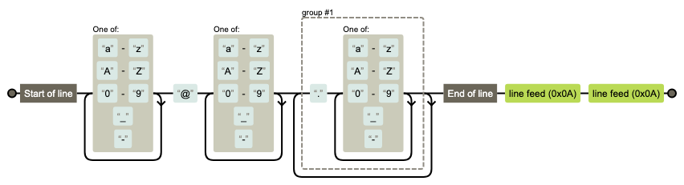
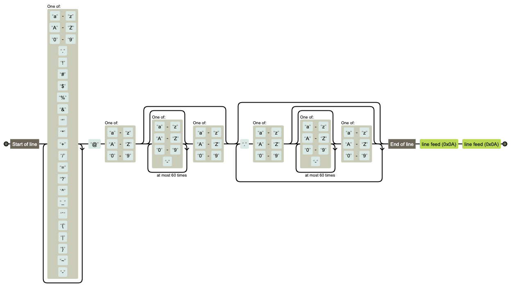
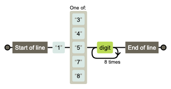
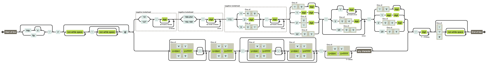
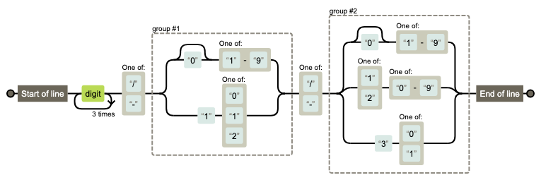
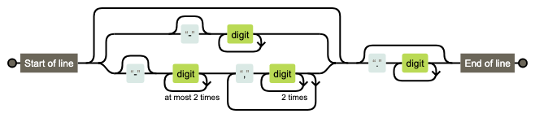
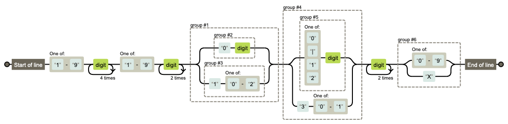

# 常用的匹配

## 匹配一个邮箱

```
^[a-zA-Z0-9_-]+@[a-zA-Z0-9_-]+(\.[a-zA-Z0-9_-]+)+$
```



```
^[a-zA-Z0-9.!#$%&'*+\/=?^_`{|}~-]+@[a-zA-Z0-9](?:[a-zA-Z0-9-]{0,61}[a-zA-Z0-9])?(?:\.[a-zA-Z0-9](?:[a-zA-Z0-9-]{0,61}[a-zA-Z0-9])?)*$
```



## 匹配一个手机号

```
^1[34578]\d{9}$
```



## 验证URL格式

```
^(?:(?:(?:https?|ftp):)?\/\/)(?:\S+(?::\S*)?@)?(?:(?!(?:10|127)(?:\.\d{1,3}){3})(?!(?:169\.254|192\.168)(?:\.\d{1,3}){2})(?!172\.(?:1[6-9]|2\d|3[0-1])(?:\.\d{1,3}){2})(?:[1-9]\d?|1\d\d|2[01]\d|22[0-3])(?:\.(?:1?\d{1,2}|2[0-4]\d|25[0-5])){2}(?:\.(?:[1-9]\d?|1\d\d|2[0-4]\d|25[0-4]))|(?:(?:[a-z\u00a1-\uffff0-9]-*)*[a-z\u00a1-\uffff0-9]+)(?:\.(?:[a-z\u00a1-\uffff0-9]-*)*[a-z\u00a1-\uffff0-9]+)*(?:\.(?:[a-z\u00a1-\uffff]{2,})).?)(?::\d{2,5})?(?:[/?#]\S*)?$
```



## 验证ISO类型的日期格式

```
^\d{4}[\/\-](0?[1-9]|1[012])[\/\-](0?[1-9]|[12][0-9]|3[01])$
```



## 验证10进制

```
^(?:-?\d+|-?\d{1,3}(?:,\d{3})+)?(?:\.\d+)?$
```



## 验证身份证号码

```
^[1-9]\d{5}[1-9]\d{3}((0\d)|(1[0-2]))(([0|1|2]\d)|3[0-1])\d{3}([0-9]|X)$
```

